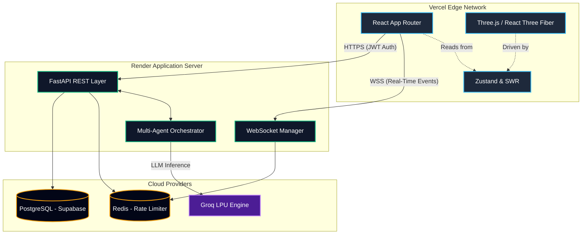

# NEXUS: The Human-AI Co-Evolution Engine

<p align="center">
  <em>A real-time adaptation platform mapping workforce capabilities against accelerating AI market demands.</em>
</p>

---

## 🌟 What is NEXUS?
NEXUS is not a traditional HR platform or Learning Management System. It is an **AI-native, 3D-accelerated co-evolution engine**. 

As the AI market evolves at unprecedented speeds, static skill matrixes become obsolete instantly. NEXUS solves this by autonomously tracking global market signals, analyzing an organization's internal capability gaps in real-time, and deploying a fleet of AI agents to orchestrate micro-learning interventions, mentorship matches, and strategic actions.

---

## 🏗️ Architecture

NEXUS uses a completely decoupled, serverless-ready architecture designed for high-throughput AI inference and instantaneous client updates.



---

## 🛠️ Deep Dive: The Technology Stack

NEXUS is built on a modern, bleeding-edge stack optimized for developer experience, extreme performance, and visual fidelity.

### 1. The Frontend Layer (Client Interface)
*   **Next.js 14 (App Router)**: Provides the foundation for the frontend, utilizing Server Components for optimal SEO and initial load times, while seamlessly supporting heavy client-side interactivity.
*   **React 19**: Leverages the latest React concurrent features to ensure the UI remains responsive even when parsing heavy websocket payloads.
*   **Tailwind CSS v4**: Utility-first styling enabling the creation of our custom, dark-themed, glassmorphism UI system (`--color-obsidian`, `--color-forest`, etc.).
*   **Framer Motion & GSAP**: Orchestrates smooth layout transitions, micro-animations, and staggered component rendering.

### 2. The 3D Graphics Engine (Visualization)
We represent abstract data (capabilities, market signals) as physical, dynamic 3D objects.
*   **Three.js & `@react-three/fiber`**: The core WebGL engine running at 60fps within the React ecosystem.
*   **`@react-three/drei`**: Provides advanced camera controls, physics (floating, distortion), and complex geometries.
*   **Custom Shaders & Materials**:
    *   `OrbScene`: A triple-layer Fibonacci sphere representing the NEXUS core.
    *   `CapabilityGraph`: Uses `MeshDistortMaterial` to represent an evolving, fluid brain of internal knowledge.
    *   `SignalNetwork`: Stratified point-clouds and `LineSegments` visualizing live market intelligence.
    *   `TalentConnection`: Particle stream physics mapping knowledge transfer between mentors and mentees.

### 3. The Backend Layer (API & Streaming)
*   **Python 3.11 & FastAPI**: Chosen for its native asynchronous capabilities and automatic OpenAPI schema generation. It handles thousands of concurrent connections efficiently.
*   **Uvicorn**: An ASGI web server implementation for Python, providing the raw speed required for our backend.
*   **WebSockets**: A dedicated `/ws` endpoint with a custom `ConnectionManager` broadcasts real-time `new_signal`, `new_action`, and `gap_update` events directly to the frontend.

### 4. The Agentic AI Engine (Intelligence)
The core of NEXUS is a fleet of specialized AI agents, operating via the **Groq API** (running Llama 3 on LPUs) for ultra-low latency inference.
*   **SignalFuserAgent**: Scrapes and synthesizes external market data into actionable intelligence.
*   **GapAnalyserAgent**: Compares the workforce's current capability vectors against future market demands to identify critical "watch" and "critical" gaps.
*   **ActionPlannerAgent**: Consumes the output of the GapAnalyser to generate bespoke, actionable micro-learning interventions and strategic plans.
*   **Semantic Kernel & AutoGen**: (Architectural implementation patterns) utilized to orchestrate these agents, handle memory retrieval, and manage multi-turn reasoning.

### 5. Infrastructure & Security (Data & Scale)
*   **PostgreSQL (`psycopg2-binary`)**: The primary relational database for persistent user accounts and organizational data, completely replacing the initial local SQLite prototype.
*   **Redis**: In-memory data store utilized by `slowapi` to enforce strict rate limiting (e.g., 60 req/min globally, 5 req/min on Auth) across multiple worker nodes.
*   **JWT & bcrypt**: Stateless authentication utilizing JSON Web Tokens and industry-standard password hashing.

---

## 🚀 Deployment (Serverless Approach)

NEXUS is designed for a decoupled, serverless deployment using **Vercel**, **Render**, and **Supabase**.

### 1. Database Setup (Supabase)
1. Create a project on [Supabase](https://supabase.com).
2. Open the SQL Editor and run the provided schema file:
   ```sql
   -- From backend/api/db/schema.sql
   CREATE TABLE IF NOT EXISTS users (
       id SERIAL PRIMARY KEY,
       email TEXT UNIQUE NOT NULL,
       name TEXT NOT NULL,
       company TEXT NOT NULL,
       hashed_password TEXT NOT NULL
   );
   CREATE INDEX IF NOT EXISTS idx_users_email ON users(email);
   ```
3. Copy your Connection URI (Transaction pooler) to be used as `DATABASE_URL`.

### 2. Backend Deployment (Render)
1. Connect this repository to [Render](https://render.com).
2. Render will automatically detect the `render.yaml` Blueprint in the root directory.
3. It will provision a **Redis instance** and a **Python Web Service**.
4. When prompted, input your `DATABASE_URL` from Supabase.
5. Once deployed, copy the public URL (e.g., `https://nexus-api.onrender.com`).

### 3. Frontend Deployment (Vercel)
1. Connect this repository to [Vercel](https://vercel.com).
2. Add the environment variable:
   - `NEXT_PUBLIC_API_URL` = `<YOUR_RENDER_BACKEND_URL>`
3. Click **Deploy**. Vercel will automatically optimize and host the Next.js frontend globally.

---

## 💻 Local Development (Docker)

If you prefer to run the stack locally, NEXUS is fully containerized.

1. Create a `.env` file in the `backend/` directory with your API keys:
   ```env
   GROQ_API_KEY=your_key_here
   ```
2. Build and run the orchestrated containers:
   ```bash
   docker-compose up --build
   ```
3. The frontend will be available at `http://localhost:3000` and the backend Swagger docs at `http://localhost:8000/docs`.

---

<p align="center">
  <em>Built for the future of enterprise adaptability.</em>
</p>
